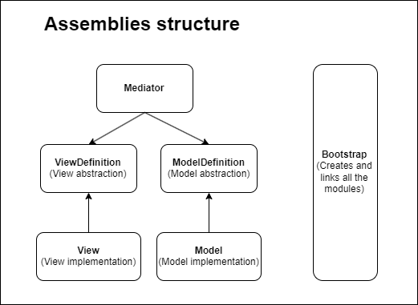
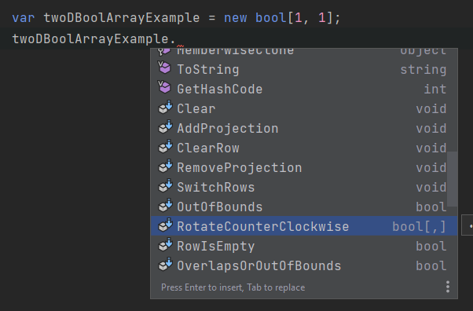
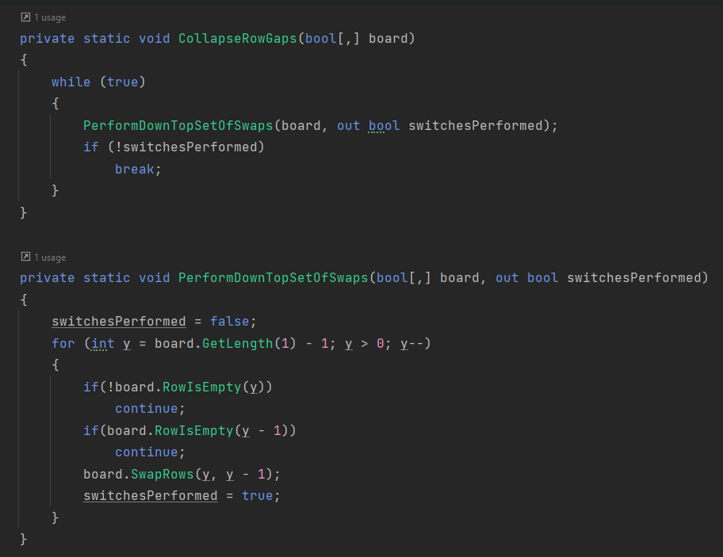

## Overall

A tetris clone I've made to exercise my architecture knowledge 
and theories on a small scale project.

  
It's a model-view-mediator controller architecture, with the 
modules isolated in their own assemblies. Additionally, model's 
and view's abstractions are extracted into their own modules, so 
that model, view AND mediator implementations can be substituted 
without any changes to the rest of the modules. The weak part of 
it for now (haven't got there yet) is an initialization layer that 
depends on all of the aforementioned modules in order to fill the
dependencies. 

## Model
The model revolves around operations upon 2d arrays of booleans
and is made of three layers. 

### Generic operations  
  
The first layer contains generic algorithms such as rotate a matrix 
or switch rows, and technically is a set of extension methods for 
bool[,] type

### Gameplay-related algorithms  
  
A set of atomic algorithms, such as "move a figure down the board"
or "collapse empty board rows top-down". These algorithms'
objects inherit from either FigureAction or BoardAction and 
remain very readable since they're based upon previous
level's methods (pic)

### Gameplay logic  
This layer contains CoreLoop and PlayerActions that operate upon 
IGameplayHandle abstraction that gives access to the board and the
current figure. CoreLoop contains a sequence of actions being 
executed in the exact order every tick, while player action can
happen in any moment depending on the input.
